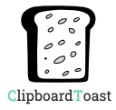

<h1 align="center">
 <br/>
</h1>

[](https://www.npmjs.com/package/react-native-clipboard-toast)
[](https://www.npmjs.com/package/react-native-clipboard-toast) 
[](https://github.com/idanlevi1/react-native-clipboard-toast/stargazers) 
[](https://www.npmjs.com/package/react-native-clipboard-toast) 


# react-native-clipboard-toast 
#### React Native Clipboard API with Animated toast message component
---

Support both Android and iOS | Used react native Clipboard | Toast by calling api


### Install

`npm install react-native-clipboard-toast`

or

`yarn add react-native-clipboard-toast`

-------

##### **Import the package**

```import ClipboardToast from 'react-native-clipboard-toast';```

##### **Calling api**

```js
<ClipboardToast
    textToShow={`Top toast with 1 second delay`}
    textToCopy={"Top text"}
    toastText={"Text copied to clipboard!"}
    id={'top'}
    containerStyle={{backgroundColor: "#DDDDDD", padding: 10, borderRadius: 5}}
    textStyle={{ fontSize: 18, color: "#223345" }}
    accessibilityLabel={"click me to copy"}
    toastPosition={'top'}
    toastDelay={1000}
    toastOnShow={()=>{console.log('Is Copied')}}
  />
```

---

## Reference

### Props

Name                | Default                  |  Type    | Description
--------------------|--------------------------|----------|---------------------------
textToShow            | null                    | String   | The text that will show (clickabily)
textToCopy            | null    | String   | The text that will be copied to the clipboard
toastText            | 'Text is copied'    | String   | The text that will show on the toast
containerStyle            | null    | | Style   | Container style
textStyle            | null    | | Style   | Text style
id             | 'someKey'                      | Number/String   | Key of element
accessibilityLabel         | null                     | String   | Accessibility label text
toastDuration            | 750    | Number   | The duration of the toast. (milliseconds)
toastPosition            | 'bottom'   | string   | The position of toast showing on screen (there are 3 options - 'bottom, 'center' and 'top')
toastDelay               | 0                        | Number   | The delay duration before toast start showing on screen.
toastAnimation           | true                     | Bool     | Should preform an animation on toast showing or disappearing.
toastHideOnPress         | true                     | Bool     | Should hide toast that showing by pressing on the toast.
toastBackgroundColor     | null                     | String   | The background color of the toast.
toastTextColor           | null                     | String   | The text color of the toast.
toastOnShow              | null                     | Function | Callback for toast\`s appear animation start


## License

This project is licensed under the MIT License - see the [LICENSE.md](https://github.com/idanlevi1/react-native-clipboard-toast/blob/master/LICENSE) file for details

## Author

Made by [Idanlevi1](https://github.com/idanlevi1).
